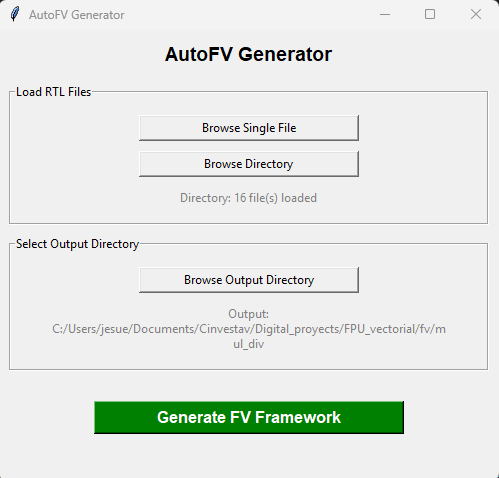

# Generate a Framework

This page explains how to generate the FPV framework using both command-line and GUI modes.

## Prerequisites

- Python 3.9 or newer
- AutoFV dependencies:

```bash
pip install -r requirements.txt
```

For GUI mode, make sure `tkinter` is available in your Python installation.

## CLI Execution

Use CLI mode when you want automation or script-based execution.

### Generate from a single RTL file

```bash
python autofv.py -f ./rtl/design.sv -o ./out
```

### Generate from an RTL directory

```bash
python autofv.py -d ./rtl -o ./out
```

### Generate recursively from subdirectories

```bash
python autofv.py -d ./rtl -o ./out -r
```

### CLI arguments

- `-f, --file`: Path to one RTL file (`.sv` or `.v`)
- `-d, --directory`: Path to a directory with RTL files
- `-o, --output`: Output directory where the framework is generated
- `-r, --recursive`: Search RTL files recursively in subdirectories (beta)

## GUI Execution

GUI mode starts when you run the tool without CLI arguments. This mode is recommend for academic purposes.

```bash
python autofv.py
```

If the GUI does not start, verify that `tkinter` is installed and available in your active Python environment.

### GUI example


