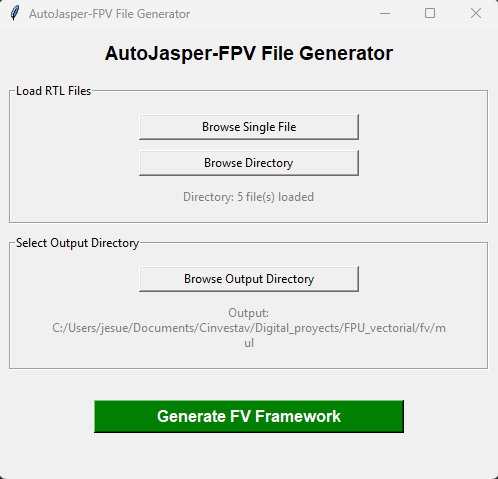

# Installation Guide

AutoJasper-FPV is designed for simplicity and minimal dependencies. This guide covers system requirements, installation steps, and platform-specific considerations.

---

## System Requirements

### Mandatory Requirements

| Requirement | Minimum Version | Notes |
|-------------|-----------------|-------|
| **Python** | 3.9 or later | Required for all modes |
| **Operating System** | Windows, macOS, Linux | Verified on all major platforms |

### Optional Requirements

| Component | Purpose | Required For |
|-----------|---------|--------------|
| **Tkinter** | GUI framework | GUI mode only (not CLI) |
| **JasperGold** | JasperGold license | Running formal verification (not for framework generation) |

---

## Python Version Check

Before installation, verify your Python version:

```bash
python --version
```

**Expected output:**
```
Python 3.9.x or later
```

If you have multiple Python installations, you may need to use:

```bash
python3 --version
```

### Installing Python

If you don't have Python 3.9 or later:

- **Windows**: Download from [python.org](https://www.python.org/downloads/)
- **macOS**: Use Homebrew: `brew install python@3.9`
- **Linux**: Use your package manager:
  - Ubuntu/Debian: `sudo apt install python3.9`
  - Fedora: `sudo dnf install python3.9`

---

## Installation Steps

### 1. Clone or Download the Repository

**Using Git:**
```bash
git clone https://github.com/your-repo/AutoJasper-FPV.git
cd AutoJasper-FPV
```

**Or manually download** and extract the project files.

### 2. Install Dependencies

Although AutoJasper-FPV uses only Python Standard Library modules, a `requirements.txt` file is provided for reference:

```bash
pip install -r requirements.txt
```

This command will ensure any development or optional dependencies are installed (currently none, but may be added in future versions).

### 3. Verify Installation

Test that AutoJasper-FPV runs correctly:

**GUI mode:**
```bash
python autojasper_fpv.py
```

A window should open with the AutoJasper-FPV interface.

**CLI mode:**
```bash
python autojasper_fpv.py --help
```

You should see the command-line help output.

---

## Platform-Specific Setup

### Windows

#### Prerequisites

- Windows 10 or later recommended
- Python from [python.org](https://www.python.org/) (include pip during installation)

#### GUI Mode Setup

Tkinter is included with Python on Windows by default. If not present, reinstall Python and ensure "tcl/tk and IDLE" is selected during installation.

#### PowerShell Users

If executing Python scripts is disabled, enable it:

```powershell
Set-ExecutionPolicy -ExecutionPolicy RemoteSigned -Scope CurrentUser
```

#### Running from Command Prompt

```cmd
cd path\to\AutoJasper-FPV
python autojasper_fpv.py
```

---

### macOS

#### Prerequisites

- macOS 10.14 or later
- Python 3.9+ (via Homebrew recommended)

#### Installation via Homebrew

```bash
brew install python@3.9
```

#### GUI Mode Setup

On macOS, Tkinter may need to be installed separately:

```bash
brew install python-tk@3.9
```

#### Running the Tool

```bash
cd /path/to/AutoJasper-FPV
python autojasper_fpv.py
```

---

### Linux

#### Prerequisites

- Supported distributions: Ubuntu 20.04+, Fedora 33+, Debian 11+, or similar
- Python 3.9+ development headers

#### Installing Dependencies

**Ubuntu/Debian:**
```bash
sudo apt update
sudo apt install python3.9 python3-pip python3-tk
```

**Fedora/RHEL:**
```bash
sudo dnf install python3.9 pip python3-tkinter
```

**Arch Linux:**
```bash
sudo pacman -S python tk
```

#### Running the Tool

```bash
cd /path/to/AutoJasper-FPV
python3.9 autojasper_fpv.py
```

#### Headless/Remote Server (CLI Only)

If running on a headless Linux server without a display:

1. GUI mode will not work (no display server)
2. Use CLI mode exclusively:

```bash
python3.9 autojasper_fpv.py -d ./rtl -o ./formal
```

---

## Virtual Environments (Recommended)

Using a Python virtual environment isolates AutoJasper-FPV dependencies and prevents conflicts with other projects.

### Creating a Virtual Environment

#### On Windows

```bash
python -m venv venv
venv\Scripts\activate
```

#### On macOS/Linux

```bash
python3.9 -m venv venv
source venv/bin/activate
```

### Activating the Environment

Each time you work with AutoJasper-FPV, activate the environment:

```bash
# Windows
venv\Scripts\activate

# macOS/Linux
source venv/bin/activate
```

Your terminal prompt should now show `(venv)` at the beginning.

### Installing in the Virtual Environment

```bash
pip install -r requirements.txt
python autojasper_fpv.py
```

### Deactivating the Environment

When finished:

```bash
deactivate
```

---

## Verifying the Installation

### Test 1: CLI Help Output

```bash
python autojasper_fpv.py --help
```

**Expected:** Displays usage information and available options.

### Test 2: GUI Launch

```bash
python autojasper_fpv.py
```

**Expected:** GUI window opens without errors.



### Test 3: Simple Framework Generation

Generate a framework for a test RTL file:

```bash
# Create a simple test design
echo "module test_module(input clk, output reg valid); endmodule" > test.sv

# Generate framework
python autojasper_fpv.py -f test.sv -o ./test_output
```

**Expected:** Directory `test_output` is created with generated artifacts:
- `fv_test_module.sv`
- `analyze.flist`
- `jg_fpv.tcl`
- `Makefile`

---

## Troubleshooting Installation

### "Python not found" Error

**Solution:** Ensure Python is installed and in your system PATH. Try:
```bash
python --version
# or
python3 --version
```

### "No module named tkinter" (GUI Mode)

**Windows:** Reinstall Python; ensure "tcl/tk and IDLE" is selected.

**macOS:** Install via Homebrew:
```bash
brew install python-tk
```

**Linux (Ubuntu/Debian):**
```bash
sudo apt install python3-tk
```

### Permission Denied (Linux/macOS)

Make the script executable:
```bash
chmod +x autojasper_fpv.py
./autojasper_fpv.py
```

### ModuleNotFoundError for Standard Library

This should not occur with Python 3.9+. If it does, verify your Python installation:
```bash
python -m ensurepip --upgrade
```

---

## Next Steps

After successful installation:

1. **Read the [System Overview](Overview.md)** — Understand CLI and GUI modes
2. **Check out [Generated Artifacts](Verification.md)** — Learn what gets created
3. **Run your first generation** — Use the quick start below

### Quick Start

**CLI (Automated):**
```bash
python autojasper_fpv.py -d ./your_rtl_directory -o ./formal_output
```

**GUI (Interactive):**
```bash
python autojasper_fpv.py
```

---

## Getting Help

If you encounter issues:

1. **Check Python version** — Must be 3.9 or later
2. **Review platform-specific section** above for your OS
3. **Verify Tkinter** if using GUI mode
4. **Try a clean virtual environment** to isolate the issue
5. **Report issues** with detailed error messages and system information

---

## System Compatibility Matrix

| OS | Python 3.9 | Python 3.10+ | GUI | CLI | Status |
|----|:----------:|:------------:|:---:|:---:|:------:|
| Windows 10/11 | ✓ | ✓ | ✓ | ✓ | Verified |
| macOS 11+ | ✓ | ✓ | ✓ | ✓ | Verified |
| Ubuntu 20.04+ | ✓ | ✓ | ✓ | ✓ | Verified |
| Fedora 33+ | ✓ | ✓ | ✓ | ✓ | Verified |
| CentOS 8 | ✓ | ✓ | ✓ | ✓ | Verified |
| Alpine Linux | ✓ | ✓ | ✓ | ✓ | Verified |

✓ = Supported and tested
